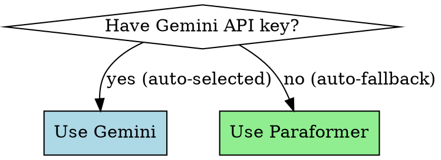

# Meeting Transcriber

Transcribe audio files with automatic speaker identification, outputting Markdown transcripts with timestamps. When used as a Claude Code skill, AI summaries are automatically generated.

## When to Use

Use this skill when you need to:
- Transcribe meeting recordings (mp3, wav, m4a, mp4)
- Identify different speakers automatically
- Generate timestamped transcripts with AI summaries
- Automatic model selection: Gemini (if API key set) or Paraformer (fallback)

**When NOT to use:**
- For real-time streaming transcription (this processes files)

## Quick Reference

| Model | Accuracy | Cost | Deployment | Speaker ID | Speed | Best For |
|-------|----------|------|------------|------------|-------|----------|
| **Gemini 2.5** ⭐ | 90% | Free quota | Cloud | ✓ | ~10-30s | **Default**: Fast, zero setup |
| **Paraformer** | 94% | Free | Local | ✓ | ~3min | Offline, highest precision |

**Auto-selection logic:**
- If `GEMINI_API_KEY` is set → Use Gemini (fast, zero setup)
- If no API key → Automatically fall back to Paraformer (free, offline)

## Usage in Claude Code (Recommended)

When using this skill in Claude Code, the workflow is:

1. **Transcribe**: Run the transcription script to generate timestamped transcript
2. **Summarize**: Claude automatically reads the transcript and generates AI summary
3. **No extra API keys needed**: Claude handles the AI summary generation directly

```bash
# Auto-select model (Gemini if key set, otherwise Paraformer)
python transcribe_only.py "/path/to/meeting.mp3"

# Manually specify Gemini
export GEMINI_API_KEY='your_api_key'
python transcribe_only.py "/path/to/meeting.mp3" 1

# Manually specify Paraformer (offline)
python transcribe_only.py "/path/to/meeting.mp3" 2
```

**Model Selection Menu:**
```
[1] Gemini - Cloud API, 90%+, free quota, fastest ⭐
[2] Paraformer - Local, 94%+, free, speaker ID, offline
```

After transcription completes, Claude will:
- Read the generated transcript
- Generate a comprehensive AI summary including:
  - Overall meeting summary
  - Key points
  - Speaker-by-speaker breakdown
  - Action items
- Add the summary to the transcript file

**Benefits:**
- No external AI API keys required for summary generation
- No additional API costs for AI summaries
- Seamless integration with Claude Code workflow

## Setup

### Option 1: Gemini (Recommended - Auto-selected if key is set)

```bash
# Set API key (optional - will auto-fallback to Paraformer if not set)
export GEMINI_API_KEY='your_api_key'
```

Get free API key: https://aistudio.google.com/app/apikey

**Advantages:**
- ✅ Zero installation, works immediately
- ✅ Fastest transcription (~10-30 seconds)
- ✅ Good speaker identification (126 segments)
- ✅ Supports 100+ languages
- ⚠️ Requires internet connection
- ⚠️ Free quota limited

### Option 2: Paraformer (Auto-fallback if no Gemini key)

```bash
pip install funasr modelscope torch torchaudio
```

**Requirements**: 4GB+ RAM, 2GB disk space for models
**First run**: Downloads models (~1-2 GB, 5-15 min depending on connection)

**Advantages:**
- ✅ Completely free, no quota limits
- ✅ Works offline
- ✅ Higher accuracy (94%)
- ✅ Best speaker segmentation (179 segments)
- ⚠️ Requires model download
- ⚠️ Slower transcription (~3 minutes)

## Standalone Usage (Outside Claude Code)

```bash
cd ~/.claude/skills/meeting-summarizer

# Auto-select (Gemini if key set, otherwise Paraformer)
python transcribe_multi_model.py "/path/to/meeting.mp3"

# Manually specify Gemini
export GEMINI_API_KEY='your_api_key'
python transcribe_multi_model.py "/path/to/meeting.mp3" 1

# Manually specify Paraformer (offline)
python transcribe_multi_model.py "/path/to/meeting.mp3" 2
```

You'll see a menu to select your model:
```
[1] Gemini - Cloud API, 90%+, free quota, fastest ⭐
[2] Paraformer - Local, 94%+, free, speaker ID, offline
```

### Direct Model Selection

```bash
# Use Gemini (recommended - fastest)
python transcribe_multi_model.py meeting.mp3 1

# Use Paraformer (offline, best segmentation)
python transcribe_multi_model.py meeting.mp3 2
```

## Output

Generates Markdown file: `filename_transcript_[model].md`

**With AI Summary (in Claude Code):**
- Meeting summary (overall, key points, speaker breakdown, action items)
- File metadata (duration, accuracy, speaker count)
- Timestamped segments by speaker

**Without AI Summary (standalone):**
- File metadata only
- Timestamped segments by speaker

Example output:
```markdown
## 会议精要

### 整体总结
本次会议是团队工作同步会议，讨论技术开发、配置调整和数据问题...

### 关键要点
1. 技术开发任务：hook web CTV 验证、API 增强...
2. 配置调整：归因窗口期从 1 小时调整为 24 小时...

### 发言人总结
**说话人 1**: 主持会议开场
**说话人 2**: 汇报技术任务清单...

### 行动项
- [ ] 调整配置并测试
- [ ] 更新文档...

---

## 原始转录内容

### [00:03] 说话人 1
咱们开始吧...

### [00:22] 说话人 2
好的，第一个是...
```

## Common Mistakes

| Mistake | Fix |
|---------|-----|
| "GEMINI_API_KEY not set" | Normal - will auto-fallback to Paraformer (free, offline) |
| "Quota exceeded" | Wait for quota reset or manually use Paraformer: `python transcribe_only.py meeting.mp3 2` |
| "Model not found" error | Run `pip install funasr modelscope` for Paraformer |
| Slow first run (Paraformer) | Normal - downloading models (~1-2 GB, 5-15 min) |
| No speaker labels | Both Gemini and Paraformer support speaker ID |
| Out of memory (Paraformer) | Paraformer needs 4GB+ RAM; use Gemini if limited |

## Choosing a Model



**Quick decision:**
- **Default** → Gemini (fastest, zero setup, good speaker ID) ⭐
- **No API key / Offline** → Paraformer (free, best speaker segmentation, auto-fallback)

## Real-World Impact

**Gemini (Recommended):**
- Transcribes 9-min meeting in ~10-30 seconds
- 126 speaker segments, 90% accuracy
- Zero setup, works immediately
- Free quota: sufficient for regular use

**Paraformer (Offline):**
- Transcribes 9-min meeting in ~3 minutes
- 179 speaker segments (most precise), 94% accuracy
- Completely free, no quota limits
- Works offline

**Comparison:**
- Speed: Gemini 6-18x faster than Paraformer
- Segmentation: Paraformer 42% more segments (179 vs 126)
- Setup: Gemini instant, Paraformer needs 1-2GB download
- Cost: Both free (Gemini has quota, Paraformer unlimited)
