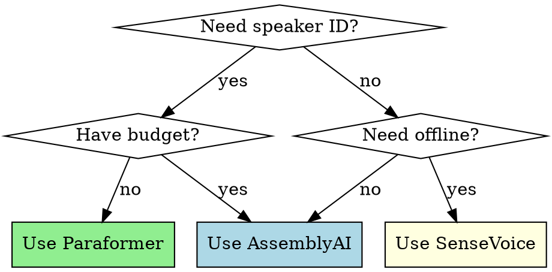

# Meeting Transcriber

Transcribe audio files with automatic speaker identification, outputting Markdown transcripts with timestamps.

## When to Use

Use this skill when you need to:
- Transcribe meeting recordings (mp3, wav, m4a, mp4)
- Identify different speakers automatically
- Generate timestamped transcripts
- Choose between free local models or paid cloud API

**When NOT to use:**
- If you need meeting summaries or analysis (this only transcribes)
- For real-time streaming transcription (this processes files)

## Quick Reference

| Model | Accuracy | Cost | Deployment | Speaker ID | Best For |
|-------|----------|------|------------|------------|----------|
| **AssemblyAI** | 87%+ | $0.25/hr | Cloud | ✓ | Quick setup, reliable |
| **SenseVoice** | 95%+ | Free | Local | ✗ | Highest accuracy, 50+ languages |
| **Paraformer** | 94%+ | Free | Local | ✓ | Free + speaker ID |

## Usage

### Interactive Mode (Recommended)

```bash
cd ~/.claude/skills/meeting-summarizer
python transcribe_multi_model.py "/path/to/meeting.mp3"
```

You'll see a menu to select your model:
```
[1] AssemblyAI - Cloud API, 87%+, $0.25/hr
[2] SenseVoice - Local, 95%+, free, 50+ languages
[3] Paraformer - Local, 94%+, free, speaker ID
```

### Direct Model Selection

```bash
# Use AssemblyAI (cloud)
python transcribe_multi_model.py meeting.mp3 1

# Use SenseVoice (local, highest accuracy)
python transcribe_multi_model.py meeting.mp3 2

# Use Paraformer (local, speaker ID)
python transcribe_multi_model.py meeting.mp3 3
```

## Setup

### Option 1: AssemblyAI Only (Fastest)

```bash
pip install requests
export ASSEMBLYAI_API_KEY='your_api_key'
```

Get API key: https://www.assemblyai.com/dashboard/signup

### Option 2: Local Models (Free)

```bash
pip install funasr modelscope torch torchaudio
```

First run downloads models (~1-2 GB). See MULTI_MODEL_GUIDE.md for details.

### Option 3: All Models

```bash
pip install requests funasr modelscope torch torchaudio
export ASSEMBLYAI_API_KEY='your_api_key'  # optional
```

## Output

Generates Markdown file: `filename_transcript_[model].md`

Format:
- File metadata (duration, accuracy, speaker count)
- Timestamped segments by speaker
- No summaries or analysis (transcription only)

Example:
```markdown
### [00:03] 说话人 A
这个注意配置不要让它在任何一个会上都加...

### [00:22] 说话人 B
好的，诶卡个去这...
```

## Common Mistakes

| Mistake | Fix |
|---------|-----|
| "Model not found" error | Run `pip install funasr modelscope` for local models |
| "API key not set" | Set `ASSEMBLYAI_API_KEY` environment variable |
| Slow first run | Normal - downloading models (~1-2 GB) |
| No speaker labels | Use AssemblyAI or Paraformer (SenseVoice doesn't support) |

## Choosing a Model



**Quick decision:**
- **Free + Speaker ID** → Paraformer
- **Highest accuracy** → SenseVoice
- **Quick setup** → AssemblyAI

## Real-World Impact

- Transcribes 1-hour meeting in ~3-5 minutes (cloud) or ~10-15 minutes (local)
- 87-95% accuracy depending on model
- Automatic speaker identification saves manual labeling time
- Free local options eliminate ongoing costs
